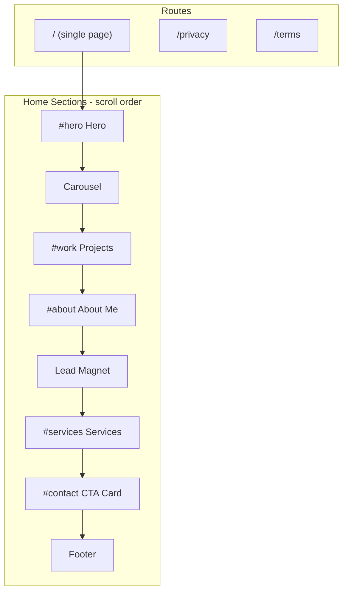
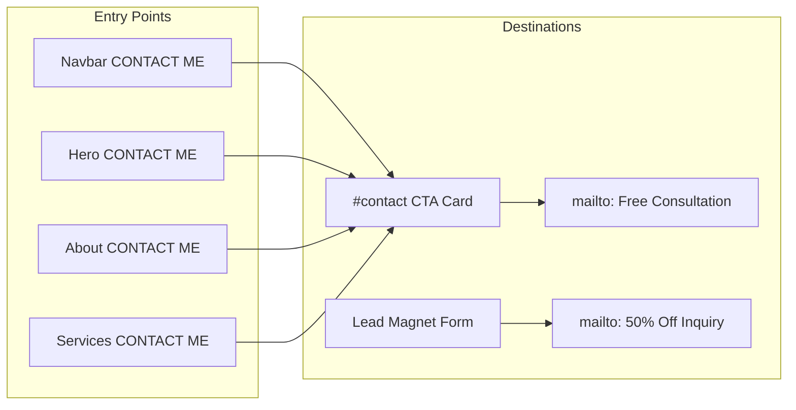

# SLADJANDEV Portfolio — PRD / Statement of Work

## 1. Document Info

| Field | Value |
|---|---|
| Project | SLADJANDEV Personal Portfolio Website |
| Client / Owner | Slađan Jeremić |
| Stack | Next.js 16, React 19, TypeScript, Tailwind CSS v4 |
| Repository | [my-portfolio](c:\Users\sladj\OneDrive\Desktop\portfolio\my-portfolio) |
| Design Source | Figma + screenshots in [design-references/](c:\Users\sladj\OneDrive\Desktop\portfolio\my-portfolio\design-references) |
| Language | English (100%) |
| Deployment | Out of scope for v1 (local dev; Vercel free tier planned later) |

---

## 2. Executive Summary

Build a **simple, fast, conversion-focused** single-page portfolio that positions Slađan primarily as a **Web Developer**, secondarily as **Webflow Developer** and **AI-Assisted Developer**. The site has **7 short sections**, follows Figma design references closely, and optimizes for turning visitors (small businesses, startups, service firms, personal brands) into email/contact inquiries.

**Primary conversion path:** Visitor clicks **CONTACT ME** → scrolls to CTA card → clicks **BOOK FREE CONSULTATION** → opens prefilled `mailto:` to `sladjanjeremi123@gmail.com`.

**Secondary conversion path:** Lead Magnet form (50% off offer) → `mailto:` with name + email.

When design conflicts with conversion, **conversion wins**.

---

## 3. Goals and Success Criteria

### Business Goals
- Present professional Web Developer identity (not "Vibe Coder")
- Demonstrate credibility via projects, stats, and services
- Capture leads via email contact (no backend in v1)
- Drive project inquiries for websites and web projects

### Success Criteria (Acceptance)
- All 7 sections render on desktop, tablet, and phone per design references
- Navbar: WORK | ABOUT ME | SERVICES + CONTACT ME CTA; mobile/tablet dropdown works
- All anchor scrolls and CTA behaviors function as specified
- Lead Magnet + CTA card use `mailto:` correctly
- About Me body text unchanged; subheadline updated only
- `/privacy` and `/terms` placeholder pages exist
- CV downloads from [public/CV.pdf](c:\Users\sladj\OneDrive\Desktop\portfolio\my-portfolio\public\CV.pdf)
- Lighthouse performance prioritized: no scroll animations beyond subtle marquee; hover-only on buttons
- Inter font loaded; brand colors applied consistently

---

## 4. Target Audience

- Small businesses needing a modern website
- Startups
- Service companies
- Personal brands
- EU remote clients (English UI)

**Not in scope:** Upwork profile link anywhere on site (text mentions inside frozen About Me copy are allowed).

---

## 5. Brand Positioning

| Priority | Label |
|---|---|
| Primary | Web Developer |
| Secondary | Webflow Developer |
| Secondary | AI-Assisted Developer |
| Avoid | "Vibe Coder" as primary identity |

---

## 6. Design System

### Color Tokens

Define in [app/globals.css](c:\Users\sladj\OneDrive\Desktop\portfolio\my-portfolio\app\globals.css) as CSS variables + Tailwind `@theme`:

| Token | Hex | Usage |
|---|---|---|
| `primary-btn` | `#0011FF` | Primary buttons, accents, highlighted words |
| `secondary-btn` | `#C8D2E7` | Secondary buttons (e.g. DOWNLOAD CV, CONTACT ME in header) |
| `primary-bg` | `#0C1C69` | Main section backgrounds |
| `project-card` | `#1C285E` | Project card backgrounds |
| `navbar-footer` | `#0C1647` | Navbar and footer background |
| `text-primary` | `#FFFFFF` | Headings, primary text |
| `text-muted` | `#C8D2E7` or similar | Body secondary text |

Additional accent colors (glow, borders, gradient in hero) derived from references to match Figma visually.

### Typography
- **Font:** Inter (replace Geist in [app/layout.tsx](c:\Users\sladj\OneDrive\Desktop\portfolio\my-portfolio\app\layout.tsx))
- Headings: bold, uppercase where shown in Figma
- Accent pattern: last word or key phrase in `#0011FF` (e.g. "Featured **work**", "About **me**")

### Interaction Rules
- **Animations:** None except button/link `:hover` states
- **Carousel:** Subtle infinite CSS marquee (slow, low CPU)
- **Smooth scroll:** `scroll-behavior: smooth` for anchor navigation
- **No:** parallax, fade-in-on-scroll, heavy glow animations

### Responsive Breakpoints (assumed standard)
- Mobile: `< 768px` — stacked layouts, hamburger/dropdown nav
- Tablet: `768px–1023px` — dropdown nav, intermediate layouts per Figma tablet screenshots
- Desktop: `>= 1024px` — full horizontal nav, multi-column layouts

References: each section folder contains `desktop-*`, `tablet-*`, `phone-*` screenshots.

---

## 7. Site Architecture



### Anchor Map

| Nav Label | Anchor ID | Target |
|---|---|---|
| WORK | `#work` | Projects section |
| ABOUT ME | `#about` | About Me section |
| SERVICES | `#services` | Services section |
| CONTACT ME (button) | `#contact` | CTA card section (pre-footer) |

**Note:** No HOME link in nav. Logo click scrolls to `#hero` (standard UX assumption).

---

## 8. Global Components

### 8.1 Header / Navbar
- **Logo:** `SLADJAN`**`DEV`** (DEV in `#0011FF`)
- **Desktop nav:** WORK | ABOUT ME | SERVICES + CONTACT ME button (`secondary-btn` style per Figma header)
- **Tablet + Mobile:** Hamburger toggles **dropdown below navbar** containing same links + CONTACT ME button
- **Background:** `#0C1647`, sticky/fixed at top
- **Reference:** [design-references/hero-section/](c:\Users\sladj\OneDrive\Desktop\portfolio\my-portfolio\design-references\hero-section)

### 8.2 Footer
- Logo, nav links (WORK, ABOUT ME, SERVICES), social icons
- Copyright: `© 2026 Sladjan Jeremic. All rights reserved.`
- Legal links: Privacy Policy, Terms of Service, Cookies Settings
- **Social links (external):**
  - LinkedIn: `https://www.linkedin.com/in/sladjan-jeremic`
  - Instagram: `https://www.instagram.com/s.jeremic_05/?hl=en`
  - Email: `mailto:sladjanjeremi123@gmail.com`
  - GitHub: `https://github.com/SladjanJ/SladjanJ`
- **Assets:** icons from [design-references/CTA-footer-section/](c:\Users\sladj\OneDrive\Desktop\portfolio\my-portfolio\design-references\CTA-footer-section)
- **Reference:** [design-references/CTA-footer-section/desktop-cta-footer-section-screenshot.png](c:\Users\sladj\OneDrive\Desktop\portfolio\my-portfolio\design-references\CTA-footer-section\desktop-cta-footer-section-screenshot.png)
- **Note:** CTA-footer phone/tablet screenshots are misnamed (`phone-services-section`, `tablet-services-section`) — use desktop reference + other section tablet/phone patterns for responsive behavior.

### 8.3 Shared UI
- `Button` variants: primary (`#0011FF`), secondary outline, secondary filled (`#C8D2E7`)
- `SectionHeading` pattern: small label + two-tone H2
- Copy assets from `design-references/*/`.png into `public/images/` during implementation

---

## 9. Section Requirements

### 9.1 Hero (`#hero`)
**Reference:** [design-references/hero-section/](c:\Users\sladj\OneDrive\Desktop\portfolio\my-portfolio\design-references\hero-section)

**Layout:** Two-column desktop (text left, photo right); mobile stacks text → buttons → photo centered.

**Copy (approved direction):**
- **Headline:** `WEB DEVELOPER FOR MODERN BUSINESS WEBSITES`
- **Subheadline:** `I build fast, modern websites that look professional, load quickly, and help your business turn visitors into paying clients.`
- Replace Figma Lorem ipsum and Webflow-first headline.

**CTAs:**
| Button | Style | Action |
|---|---|---|
| CONTACT ME | Primary | Smooth scroll to `#contact` |
| MY WORK | Secondary outline + eye icon | Smooth scroll to `#work` |

**Assets:**
- `hero-image.png` — developer cutout
- `eye-in-button.png` — MY WORK icon

---

### 9.2 Carousel (Tech Stack Ticker)
**Reference:** [design-references/carousel-section/](c:\Users\sladj\OneDrive\Desktop\portfolio\my-portfolio\design-references\carousel-section)

**Behavior:** Infinite horizontal marquee, subtle speed, logos: Python, GitHub, Webflow, Figma, Jupyter.

**Assets:** `python-img.png`, `github-img.png`, `webflow-img.png`, `figma-img.png`, `jupyter-img.png`

**Implementation:** CSS `@keyframes` translateX loop; duplicate logo set for seamless scroll; `prefers-reduced-motion` disables animation.

---

### 9.3 Projects (`#work`)
**Reference:** [design-references/projects-section/](c:\Users\sladj\OneDrive\Desktop\portfolio\my-portfolio\design-references\projects-section)

**Section copy:**
- Label: `WORK`
- Heading: `Featured` + `work` (accent)
- Description (replace Lorem): `A selection of projects that show how I design, build, and deliver websites and web solutions for real business goals.`

**3 Project Cards:**

| # | Title | Description | Link | Image | Tags |
|---|---|---|---|---|---|
| 1 | Personal Portfolio Website | Custom-coded portfolio built with Next.js, TypeScript, and Tailwind — designed in Figma and optimized for conversions. | `/#hero` (same page) | Temp: hero desktop screenshot from design-references; replace with live screenshot post-launch | Next.js, Figma (use closest tag icons) |
| 2 | Product Classifier | ML model with 98.6% accuracy — Python, pandas, scikit-learn, and TF-IDF for intelligent product categorization. | [GitHub profile](https://github.com/SladjanJ/SladjanJ) | `second-project-img.png` | Python, Machine Learning |
| 3 | Figma Prototypes | UI/UX design for web apps — responsive layouts focused on clarity, usability, and conversion. | [Figma design](https://www.figma.com/design/1Rgq5wYbcwAyvudZZZxXnX/Portfolio?node-id=0-1&t=E9MIP1vKsUzDnazt-1) | `third-project-img.png` | Figma |

**Card styling:** Background `#1C285E`, "View project >" link in accent blue.

**Bottom button:** MY WORK (eye icon) → scroll to `#work` (stays in section) OR acts as visual repeat — implement as scroll-to-top of section.

**Assets:** tag icons in projects-section folder.

---

### 9.4 About Me (`#about`)
**Reference:** [design-references/about-me-section/](c:\Users\sladj\OneDrive\Desktop\portfolio\my-portfolio\design-references\about-me-section)

**FROZEN (do not edit):**
- All body paragraphs, bullet list, stats rows, floating info card content
- Stats: 5 Upwork reviews, 100% client satisfaction, 3x faster Webflow sites

**ALLOWED change — subheadline only:**
- **From (Figma):** `Hi, I'm Slađan – Webflow Developer & ML Engineer`
- **To:** `Hi, I'm Slađan – Web Developer specializing in Webflow & AI-assisted builds`

**Buttons:**
| Button | Action |
|---|---|
| GET TO KNOW ME → renamed **CONTACT ME** | Scroll to `#contact` |
| DOWNLOAD CV | Download [public/CV.pdf](c:\Users\sladj\OneDrive\Desktop\portfolio\my-portfolio\public\CV.pdf) |

**Assets:** profile photo from `logo-img.png`, LinkedIn badge `linkedin-img.png`, download icon `download-icon-in-button.png`

**Floating card "Let's Connect":** GitHub, LinkedIn, Email as text links (no Upwork link).

---

### 9.5 Services (`#services`)
**Reference:** [design-references/services-section/](c:\Users\sladj\OneDrive\Desktop\portfolio\my-portfolio\design-references\services-section)

**Header copy (updated from Figma):**
- Eyebrow: `Complete digital solutions for growing your business`
- **Heading:** `Web Development & Digital Solutions` (replaces "Webflow Development & Analytics")
- CTA button: **CONTACT ME** (replaces GET TO KNOW ME) → scroll to `#contact`

**4 service items (keep structure, polish descriptions for client audience):**

| # | Icon | Title | Description |
|---|---|---|---|
| 1 | first-cookie-icon.svg | Landing page design | Modern, conversion-focused landing page designs that capture attention, communicate value, and guide users toward action. |
| 2 | second-code-icon.svg | Landing page development | Fast, responsive websites and Webflow pages built with clean structure, optimized performance, and scalable components. |
| 3 | third-database-icon.svg | CRM optimization | Streamlined CRM setups and workflows to manage leads, automate processes, and improve customer relationships. |
| 4 | fourth-analytic-icon.svg | Analytics analysis | In-depth analysis of user behavior and site performance to optimize conversions and support data-driven decisions. |

**Layout:** Left headline + CTA; right vertical timeline with numbered steps 1–4.

---

### 9.6 Lead Magnet
**Reference:** [design-references/lead-magnet-section/](c:\Users\sladj\OneDrive\Desktop\portfolio\my-portfolio\design-references\lead-magnet-section)

**Offer (real):**
- Badge: `Limited-time offer`
- **Headline:** `Get` + `50% OFF` + `Your Website Project`
- **Subtext:** `Conversion-focused websites built to grow your business. 50% off for the first 10 clients — final price based on project scope.`
- **Scarcity:** `First 10 clients only` (no live counter, no "8 spots left")
- Remove hardcoded `€500` per client decision (price varies by project)

**Form fields:** Name, Email (with user/email icons from references)

**Submit behavior:** `mailto:sladjanjeremi123@gmail.com` with prefilled subject `50% Off Website Inquiry` and body containing entered name + email.

**Footer note:** `By submitting, you agree to our Terms and Conditions` (link to `/terms`).

**Not in navbar** — discovered via scroll only.

---

### 9.7 CTA Card + Footer (`#contact`)
**Reference:** [design-references/CTA-footer-section/](c:\Users\sladj\OneDrive\Desktop\portfolio\my-portfolio\design-references\CTA-footer-section)

**CTA Card (primary contact destination):**
- **Headline:** `Start your web project today`
- **Subtext:** `Free 15-minute consultation. Get a site that sells — plus guidance on performance and analytics.`
- **No discount on this card** (Lead Magnet owns the 50% offer)
- **Button:** `BOOK FREE CONSULTATION →`
- **Action:** `mailto:sladjanjeremi123@gmail.com?subject=Free 15-min consultation - Portfolio&body=Hi Sladan,%0A%0AI'd like to book a free consultation.%0A%0AName:%0ABusiness:%0AProject details:`

Decorative glow circles per Figma; card on dark navy background.

---

## 10. Legal Pages

| Route | Content |
|---|---|
| `/privacy` | Generic English placeholder privacy policy |
| `/terms` | Generic English placeholder terms of service |

Footer "Cookies Settings" can link to `/privacy#cookies` or open simple placeholder section — minimal v1 implementation.

---

## 11. Contact Flow Diagram



---

## 12. File / Folder Structure (Proposed)

```
app/
  layout.tsx          # Inter font, metadata, global layout
  page.tsx            # Compose all sections
  globals.css         # Design tokens + Tailwind theme
  privacy/page.tsx
  terms/page.tsx
components/
  layout/
    Header.tsx
    Footer.tsx
    MobileNav.tsx
  sections/
    HeroSection.tsx
    CarouselSection.tsx
    ProjectsSection.tsx
    AboutSection.tsx
    ServicesSection.tsx
    LeadMagnetSection.tsx
    ContactSection.tsx
  ui/
    Button.tsx
    ProjectCard.tsx
    ServiceItem.tsx
lib/
  constants.ts        # Links, colors, copy, project data
  mailto.ts           # mailto URL builders
public/
  CV.pdf
  images/             # Copied/optimized assets from design-references
```

---

## 13. Metadata and SEO (v1)

Update [app/layout.tsx](c:\Users\sladj\OneDrive\Desktop\portfolio\my-portfolio\app\layout.tsx):

- **Title:** `Sladjan Jeremic | Web Developer`
- **Description:** `Web Developer building fast, conversion-focused websites for modern businesses. Webflow, custom code, and AI-assisted development.`
- **lang:** `en`
- Open Graph basics (title, description) — no custom OG image required in v1

---

## 14. Implementation Phases

**Build order (conversion-first):** When choosing between phases, prioritize working contact paths early.

| Phase | Deliverable | Rationale |
|---|---|---|
| 1 | Design tokens, Inter font, layout shell, Header, Footer, anchor scroll | Foundation |
| 2 | Hero + `#contact` CTA card + all CONTACT ME scroll wiring | Primary conversion path |
| 3 | Lead Magnet + mailto form | Secondary conversion path |
| 4 | Projects section | Credibility |
| 5 | About Me section | Trust (frozen copy) |
| 6 | Services section | Offer clarity |
| 7 | Carousel marquee | Visual polish |
| 8 | `/privacy`, `/terms`, metadata, asset optimization | Compliance + SEO |
| 9 | Responsive QA against all design-reference breakpoints | Quality gate |

**Page scroll order (user-facing):** Always Hero → Carousel → Projects → About → Lead Magnet → Services → Contact → Footer (Figma order).

---

## 15. Out of Scope (v1)

- Vercel deployment and custom domain
- Backend form handling (Formspree, Resend, etc.)
- WhatsApp integration
- Upwork profile link anywhere on site
- Blog / case study subpages
- CMS integration
- Analytics setup (Google Analytics, etc.)
- Cookie consent banner (placeholder link only)
- Dynamic scarcity counter
- Dark/light mode toggle (dark-only design)

---

## 16. Asset Inventory

All source assets live under [design-references/](c:\Users\sladj\OneDrive\Desktop\portfolio\my-portfolio\design-references). Copy to `public/images/` during build.

| Section | Key Assets |
|---|---|
| hero-section | hero-image.png, eye-in-button.png, 3 breakpoints |
| carousel-section | 5 tech logos, 3 breakpoints |
| projects-section | second-project-img.png, third-project-img.png, 4 tag icons, 3 breakpoints |
| about-me-section | logo-img.png, linkedin-img.png, download-icon-in-button.png, 3 breakpoints |
| services-section | 4 SVG icons, 3 breakpoints |
| lead-magnet-section | user-icon-img.png, email-icon-img.png, 3 breakpoints |
| CTA-footer-section | 4 social icons, desktop + misnamed tablet/phone refs |

**Missing asset:** `first-project-img` — use hero desktop screenshot temporarily.

---

## 17. Assumptions

1. Logo click scrolls to `#hero` (HOME removed from nav)
2. Standard breakpoints 768px / 1024px unless Figma specifies otherwise
3. `CV.pdf` exists at [public/CV.pdf](c:\Users\sladj\OneDrive\Desktop\portfolio\my-portfolio\public\CV.pdf) (confirmed present)
4. Upwork may appear in frozen About Me text but never as hyperlink
5. Project 1 tags use best-fit icons from existing tag set (Webflow/Figma or add simple text badges if no Next.js icon)
6. Lead Magnet €500 starting price removed; scope-based pricing copy used instead
7. Cookies Settings links to privacy page anchor in v1
8. All external links open in new tab with `rel="noopener noreferrer"`

---

## 18. Quality Checklist (Definition of Done)

- [ ] Pixel-faithful layout vs design references at 3 breakpoints
- [ ] All 4 CONTACT ME entry points scroll to `#contact`
- [ ] MY WORK scrolls to `#work`
- [ ] Lead Magnet mailto includes user inputs
- [ ] CTA card mailto opens with consultation template
- [ ] CV download works
- [ ] About Me body text byte-identical to approved copy; only subheadline changed
- [ ] No Upwork URLs in codebase
- [ ] Inter font loaded; Geist removed
- [ ] Marquee respects `prefers-reduced-motion`
- [ ] Privacy and Terms pages reachable from footer
- [ ] No console errors; `npm run build` passes
